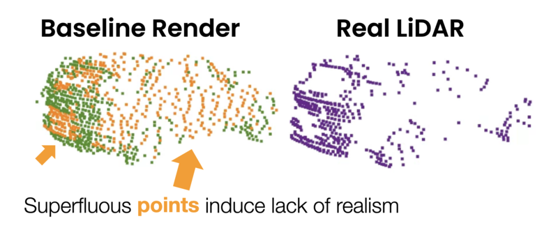
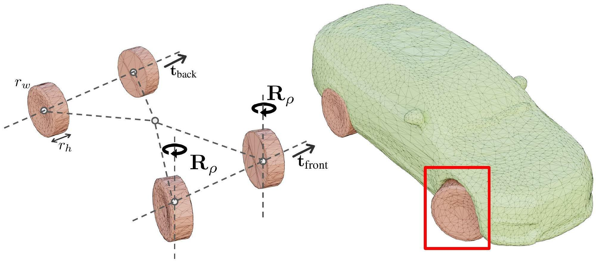
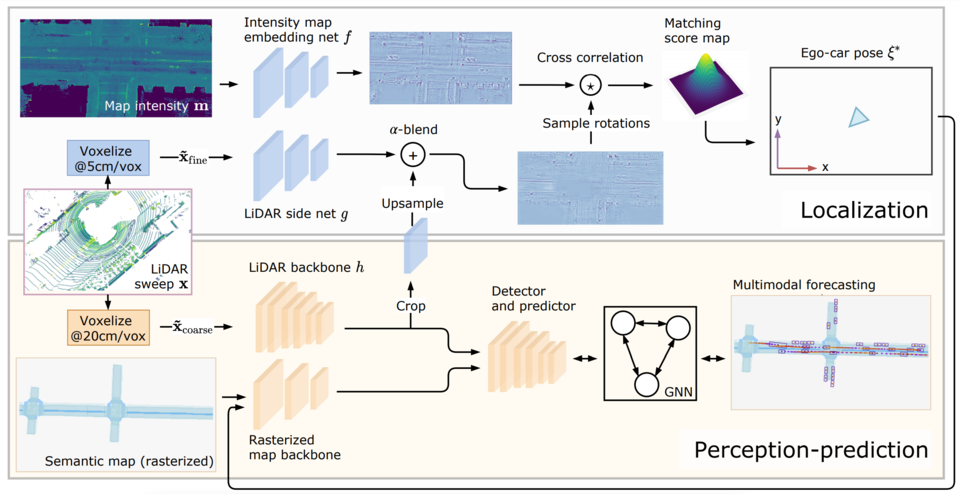
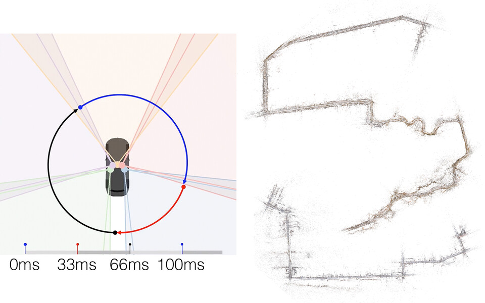
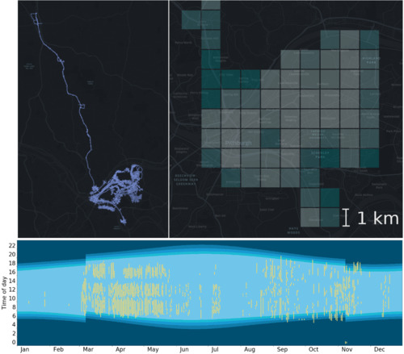
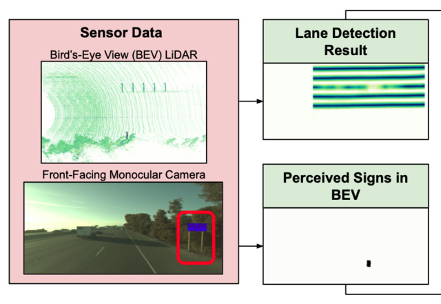
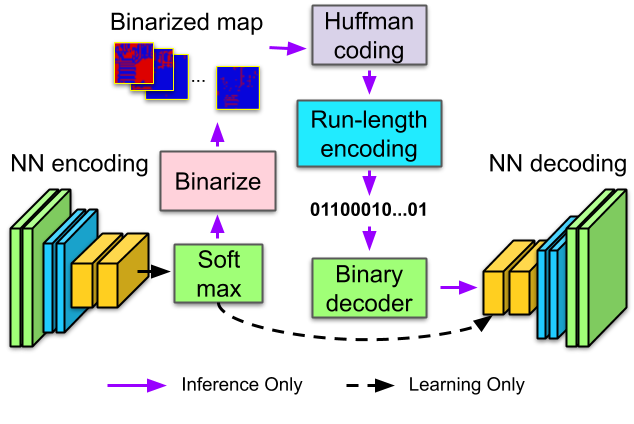
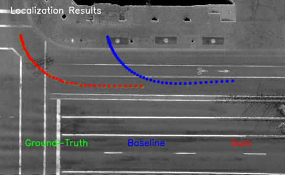
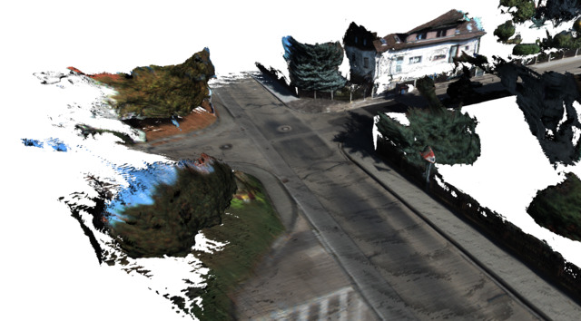

I'm a PhD candidate in the [Machine Learning
Group](http://learning.cs.toronto.edu/) at the University of Toronto,
focusing on computer vision and deep learning for
robotics and long-term autonomy. I started in September 2017, under the supervision of
<a href="http://www.cs.toronto.edu/~urtasun">Professor Raquel Urtasun</a>.

I am also a full-time senior research scientist at <a href="https://waabi.ai/" target="blank">Waabi</a>, helping develop the
next generation of AI-first autonomous vehicles. <a href="https://jobs.lever.co/waabi" target="blank">We are hiring!</a>

Before this, I spent three wonderful years as a researcher at [Uber Advanced
Technologies Group (ATG)](https://web.archive.org/web/20210114202422/https://www.uber.com/us/en/atg/)
Toronto, working on applying my research to the challenges associated with
autonomous driving in the real world.

<h2>Education</h2>

- PhD Candidate at the <a href="http://learning.cs.toronto.edu" target="_blank">University
  of Toronto (Sep 2017--present)</a>
- MSc. in Computer Science with Distinction from
  <a href="https://inf.ethz.ch" target="_blank">ETH Zürich</a> (Sep 2015--Aug 2017)
- BSc. in Applied Computer Science from <a href="http://mateinfo.unitbv.ro"
  target="_blank">Transilvania University</a>, Brașov,
  Romania (Sep 2011--Jul 2014)

<h2>Publications</h2>

<h3>
  New
  <a href="https://waabi.ai/lidar-dg" target="_blank">
    Towards Zero Domain Gap: A Comprehensive Study of Realistic LiDAR Simulation for Autonomy Testing
    (<abbr title="International Conference on Computer Vision">ICCV</abbr> 2023)
  </a>
</h3>

  

  
   
  <strong>Note:</strong> &#42;denotes equal contribution.
   
  <a class="badge" href="https://waabi.ai/lidar-dg" target="_blank">Web</a>
  <a class="badge pdf" href="/assets/pdf/manivasagam-towards-iccv-23.pdf" target="_blank">PDF</a>
  <a class="badge bibtex" href="/assets/bib/manivasagam-towards-iccv-23.bib" target="_blank">BibTeX</a>
  <a class="badge poster" href="/assets/pdf/posters/MANIVASAGAM-Siva-2023-ICCV-LiDAR-DG-Poster-v0.1.pdf" 
    target="_blank">Poster</a>
  

    <b>TL;DR:</b> We propose a thorough methodology for evaluating how realistic a self-driving vehicle simulator is, and use it to quantify the importance of reflectance modeling and other factors when simulating LiDAR.
  

 <!-- paper row -->

<h3>
  <a href="https://openreview.net/pdf?id=Mp3Y5jd7rnW" target="_blank">
    CADSim: Robust and Scalable in-the-wild 3D Reconstruction for Controllable Sensor Simulation
    (<abbr title="Conference on Robot Learning">CoRL</abbr> 2022)
  </a>
</h3>

  <a href="https://openreview.net/pdf?id=Mp3Y5jd7rnW" target="_blank">
  

    <video loop muted
           alt="CADsim visualization (still frame and a short demo video on hover)."
           title="Example camera input which, together with a LiDAR and a template mesh is used to produce an efficient, realistic, and riggable reconstruction of the observed cars."
    >
      <source src="assets/video/cadsim-mini-preview.mp4"  type="video/mp4" />
    </video>
    
  

  </a>

  
   
  <strong>Note:</strong> &#42;denotes equal contribution.
   
  <a class="badge" href="https://waabi.ai/cadsim/">Web</a>
  <a class="badge pdf" href="https://openreview.net/pdf?id=Mp3Y5jd7rnW" target="_blank">PDF</a>
  <a class="badge bibtex" href="/assets/bib/wang-cadsim-corl-22.bib" target="_blank">BibTeX</a>
  

    <b>TL;DR:</b> Automatically build "game-ready" rigged 3D meshes from observed
    data by optimizing vertices and material properties from a template mesh.
  

 <!-- paper row -->

<h3>
  <!-- New -->
  <a href="https://arxiv.org/abs/2101.06720" target="_blank">
    Deep Multi-Task Learning for Joint Localization, Perception, and Prediction
    (<abbr title="International Conference on Computer Vision and Pattern
    Recognition">CVPR</abbr> 2021)
  </a>
</h3>

  

  
   
  <strong>Note:</strong> &#42;denotes equal contribution.
   
  <a class="badge web" href="/multi-task-lp3" target="_blank">Web</a>
  <a class="badge pdf" href="https://arxiv.org/abs/2101.06720" target="_blank">PDF (arXiv)</a>
  <a class="badge bibtex" href="/assets/bib/phillips-multi-task-cvpr-21.bib" target="_blank">BibTeX</a>
  <a class="badge poster" href="/assets/pdf/posters/PHILLIPS-John-2021-CVPR-Multi-Task-LP3-Poster-v9.0.pdf" target="_blank">Poster</a>
  <a class="badge video" href="/assets/multi-task-lp3/lp3-cvpr-vid-v1.2.crf24.mp4" target="_blank">Video (Download)</a>
  <a class="badge video" href="https://www.youtube.com/watch?v=u31uEg5HfRc" target="_blank">Video (YouTube)</a>
  

    <b>TL;DR:</b>
    We show that object detection and prediction systems for self-driving cars can
    tolerate relatively large sensor-to-map misalignments (up to 0.5m) without
    errors increasing too much. However, motion planning is much more sensitive.
    We propose a lightweight 2ms-overhead multi-task approach to correct the pose
    and increase resilience to localization errors.
     
     
     
  

<h3>
  <a href="https://openaccess.thecvf.com/content/CVPR2021/papers/Martinez_Permute_Quantize_and_Fine-Tune_Efficient_Compression_of_Neural_Networks_CVPR_2021_paper.pdf" target="_blank">
    Permute, Quantize, and Fine-tune: Efficient Compression of Neural Networks
    (<abbr title="International Conference on Computer Vision and Pattern
    Recognition">CVPR</abbr> 2021)
  </a>
</h3>

  

  
   
  <strong>Note:</strong> &#42;denotes equal contribution.
   
  <a class="badge pdf" href="https://arxiv.org/abs/2010.15703" target="_blank">PDF (arXiv)</a>
  <a class="badge bibtex" href="/assets/bib/martinez-quantization-cvpr-21.bib" target="_blank">BibTeX</a>
  <a class="badge code" href="https://github.com/una-dinosauria/permute-quantize-finetune" target="_blank">Code</a>
  

    <b>TL; DR:</b>
    A simple yet effective low-overhead method for compressing neural network weights using a form of
    product quantization.  

    By permuting (Step 1) the rows of the weight matrices in an optimal way, we can maximize the effectiveness of
    quantization (Step 2). The key ingredient is fine-tuning (Step 3) the dictionary post-quantization, while keeping
    the weight codes fixed. This can be done using vanilla autodiff, e.g., in PyTorch.  

    We show this approach maintains the vast majority of the original networks' performance on classification and
    object detection, while reducing the memory footprint of their parameters by nearly 20x. The code is <a href="https://github.com/una-dinosauria/permute-quantize-finetune" target="_blank">open source</a>.

  

  <!-- paper row -->

<h3>
  <a href="https://arxiv.org/abs/2101.06562" target="_blank">
    Asynchronous Multi-View SLAM
    (<abbr title="International Conference on Robotics and Automation">ICRA</abbr> 2021)
  </a>
</h3>

  <a href="https://arxiv.org/abs/2101.06562" target="_blank">
  

    <video loop muted
           alt="AMV-SLAM overview (still frame and a short demo video on hover)."
           title="The sensor configuration of AMV-SLAM and a preview of our qualitative results. We preview a single camera (the front wide one) but our system uses all seven cameras. Please have a look at our full video on YouTube for detailed qualitative results. The static preview depicts the vehicle camera configuration in a top-down view, as well as top-down views of two maps generated by our multi-camera systems. Camera configuration diagram credit: Davi Frossard"
    >
      <source src="assets/video/amv-mini-preview.mp4"  type="video/mp4" />
    </video>
    
  

  </a>

  
   
  <strong>Note:</strong> &#42;denotes equal contribution.
   
  <a class="badge" href="http://www.cs.toronto.edu/~ajyang/amv-slam/">Web</a>
  <a class="badge pdf" href="https://arxiv.org/abs/2101.06562" target="_blank">PDF (arXiv)</a>
  <a class="badge bibtex" href="/assets/bib/yang-amv-slam-icra-21.bib" target="_blank">BibTeX</a>
  <a class="badge video" href="https://www.youtube.com/watch?v=oqv-yhcziMU" target="_blank">Talk Video (YouTube)</a>
  <a class="badge video" href="https://www.youtube.com/watch?v=UBgc0cXqXlw" target="_blank">Results Video</a>
  

    <b>TL;DR:</b> We analyze Simultaneous Localization and Mapping (SLAM) in a setting where multiple cameras are
    attached to a robot but fire at different times, e.g., by following a spinning LiDAR. We extend a classic SLAM
    formulation with a continuous time motion model that integrates these asynchronous observations robustly and
    efficiently. Our system robustly initializes and tracks its pose in crowded environments and closes loops using
    all camera information.
      
    We evaluate our method on a new large-scale multi-camera SLAM benchmark and demonstrate the benefits of
    asynchronous sensor modeling at scale.
  

 <!-- paper row -->

<h3>
  Available
  <a href="https://arxiv.org/abs/2012.12437" target="_blank">
    Pit30M: A Benchmark for Global Localization in the Age of Self-Driving Cars
    (<abbr title="International Conference on Intelligent Robots and Systems">IROS</abbr> 2020)
  </a>
</h3>

  

  
   
  International Conference on Intelligent Robots and Systems (<strong>IROS</strong>) 2020
   
  
Best Application Paper Finalist!

  <a class="badge" href="https://uber.com/atg/datasets/pit30m" target="_blank">Web</a>
  <a class="badge pdf" href="https://arxiv.org/abs/2012.12437" target="_blank">PDF (arXiv)</a>
  <a class="badge bibtex" href="/assets/bib/martinez-pit30m-iros-20.bib" target="_blank">BibTeX</a>
  <a class="badge slides" href="https://studiolab.sagemaker.aws/import/github/pit30m/pit30m/blob/main/examples/tutorial_00_introduction.ipynb" target="_blank" title="View and run notebook. Please be patient the first time you load it!">Play with it!</a>
  <a class="badge video" href="https://www.youtube.com/watch?v=hJ6A_1YSITo" target="_blank">Overview Video (90s)</a>
  <a class="badge video" href="https://www.youtube.com/watch?v=W_ZJ9oojp-o" target="_blank">IROS Talk (15min)</a>
  <a class="badge code" href="https://github.com/pit30m/pit30m" target="_blank">Code</a>
  

    <b>TL;DR:</b> A new self-driving dataset containing >30M HD images and LiDAR sweeps covering Pittsburgh
    over one year, all with centimeter-level pose accuracy. We investigate the potential of
    retrieval-based localization in this setting, and show that simple architecture (e.g., ResNet + global pool) perform
    surprisingly well, outperforming more complex architectures like NetVLAD.
    <!-- haha HTML go -->  
    The figure shows the geographic (top) and temporal (bottom, x = date, y = time of day) extent of the data.
      
    <!-- We are hard at work preparing the benchmark website and data download! Stay tuned! -->
    <!-- Yep, still working super hard on it as of Jan 2021! -->
    <!-- No progress in 2022. :( -->
    <!-- Released in 2023! -->
  

 <!-- paper row -->

<h3>
  <a href="https://arxiv.org/abs/1908.03274" target="_blank">
    Exploiting Sparse Semantic HD Maps for Self-Driving Vehicle Localization
    (<abbr title="International Conference on Intelligent Robots and Systems">IROS</abbr> 2019)
  </a>
</h3>

  

  
   
  International Conference on Intelligent Robots and Systems (<strong>IROS</strong>) 2019
   
  <strong>Note:</strong> &#42;denotes equal contribution.
   
  <a class="badge pdf" href="https://arxiv.org/abs/1908.03274" target="_blank">PDF (arXiv)</a>
  <a class="badge bibtex" href="/assets/bib/ma-sparse-maps-iros-19.bib">BibTeX</a>
  <a class="badge slides" href="/assets/pdf/talks/BARSAN-IoanAndrei-2019-IROS-SparseHDMaps-Talk-v6.pdf" target="_blank">Talk Slides (PDF)</a>
  <a class="badge slides" href="/assets/key/talks/BARSAN-IoanAndrei-2019-IROS-SparseHDMaps-Talk-v6.key"
     title="The Keynote slides have the original animations as well as a video not available in the PDF version."
     target="_blank">Talk Slides (Apple Keynote)</a>
  <a class="badge video" href="https://youtu.be/-_PvPPr7y28" target="_blank">Video</a>
  

    <b>TL;DR:</b> We use very sparse maps consisting in lane graphs (i.e., polylines) and stored
    traffic sign positions to localize autonomous vehicles. These maps take up ~0.5MiB/km2,
    compared to, e.g., LiDAR ground intensity images which
    can take >100MiB/km2. We use these maps in the context of a histogram filter localizer, and show
    median lateral accuracy of 0.05m and median longitudinal accuracy of 1.12m on a highway dataset.
  

 <!-- paper row -->

<h3>
  <a href="http://openaccess.thecvf.com/content_CVPR_2019/html/Wei_Learning_to_Localize_Through_Compressed_Binary_Maps_CVPR_2019_paper.html" target="_blank">
    Learning to Localize through Compressed Binary Maps
    (<abbr title="International Conference on Computer Vision and Pattern
    Recognition">CVPR</abbr> 2019)
  </a>
</h3>

  

  
   
  International Conference on Computer Vision and Pattern Recognition (<strong>CVPR</strong>) 2019
   
  <strong>Note:</strong> &#42;denotes equal contribution.
   
    <a class="badge pdf" href="https://1fykyq3mdn5r21tpna3wkdyi-wpengine.netdna-ssl.com/wp-content/uploads/2019/05/Learning-to-Localize-through-Compressed-Binary-Maps.pdf" target="_blank">PDF</a>
    <a class="badge bibtex" href="/assets/bib/wei-binary-maps-cvpr-19.bib" target="_blank">BibTeX</a>
    <a class="badge poster" href="/assets/pdf/posters/BARSAN-IoanAndrei-2019-CVPR-CBC-Poster-v0.6.pdf" target="_blank">Poster</a>
    <a class="badge video" href="https://youtu.be/vL9F6qfwBFk" target="_blank">Video</a>
  

    <!-- TODO(andreib): Use proper CSS and consider making panels collapsible. -->
    <b>TL;DR:</b> High-resolution maps can take up a lot of storage.
    We use neural networks to perform task-specific compression to address this
    issue by learning a special-purpose compression scheme specifically for localization.
    We achieve two orders of magnitude of improvement over
    traditional methods like WebP, as well as less than
    half the bitrate of a general-purpose learning-based compression scheme.
    For reference, PNG takes up 700&times; more storage on our dataset.
  

<h3>
<a href="http://proceedings.mlr.press/v87/barsan18a.html" target="_blank">Learning to Localize Using a LiDAR Intensity Map (CoRL 2018)</a>
</h3>

  

  

     
     Proceedings of the Second Conference on Robot Learning (<strong>CoRL</strong>) 2018
      
     <strong>Note:</strong> &#42;denotes equal contribution.
      
     <a class="badge pdf" href="http://proceedings.mlr.press/v87/barsan18a.html" target="_blank">PDF</a>
     <a class="badge bibtex" href="/assets/bib/barsan-learning-to-localize-corl-18.bib" target="_blank">BibTeX</a>
     <a class="badge poster" href="/assets/pdf/posters/BARSAN-IoanAndrei-2018-CoRL-LearningToLocalize-Poster-v0.6.pdf" target="_blank">Poster</a>
     <a class="badge slides" href="/assets/pdf/talks/BARSAN-IoanAndrei-2018-CoRL-LearningToLocalize-Talk-v3.pdf" target="_blank">Talk Slides (PDF)</a>
     <a class="badge video" href="https://www.youtube.com/watch?v=ISQZzWZmbEs" target="_blank">Video</a>
    

      <b>TL;DR:</b> Matching-based localization methods using LiDAR can provide
        centimeter-level accuracy, but require careful beam intensity
        calibration in order to perform well. In this paper, we cast the
        matching problem as a learning task and show that it is possible to
        learn to match online LiDAR observations to a known map without
        calibrated intensities.
    

  

 <!-- end .paper .row -->

<h3>
<a href="/dynslam">Robust Dense Mapping for Large-Scale Dynamic Environments (ICRA 2018)</a>
</h3>

  

  

    
     
    IEEE International Conference on Robotics and Automation (<strong>ICRA</strong>) 2018
     
    <a class="badge" href="dynslam/">Web</a>
    <a class="badge pdf" href="assets/dynslam/BARSAN-IoanAndrei-RobustDenseMapping-ICRA-2018-CameraReady.pdf"
       target="_blank">PDF</a>
    <a class="badge bibtex" href="/assets/bib/barsan-robust-dense-mapping-icra-18.bib"
       target="_blank">BibTeX</a>
    <a class="badge poster" href="/assets/pdf/posters/BARSAN-IoanAndrei-2018-ICRA-DynSLAM-Poster-v0.4.pdf" target="_blank">Poster</a>
    <a class="badge code" href="https://github.com/AndreiBarsan/DynSLAM" target="_blank">Code</a>
    

      <b>TL;DR:</b> A system for outdoor online mapping using a stereo camera
      capable of also reconstructing the dynamic objects it encounters, in
      addition to the static map. Supports map pruning to eliminate stereo
      artifacts and reduce memory consumption to less than half.
    

  

 <!-- end .paper .row -->

<h2>Work Experience</h2>

<h3>Industry</h3>

- Full-time senior scientist at a <a href="https://waabi.ai" target="_blank">**Waabi**</a> (Mar 2021--Present).
- Full-time research scientist at **Uber ATG Toronto** (Jan 2018--Feb 2021).
  - Helping develop scalable and robust centimeter-accurate
    **localization** methods for **self-driving cars**.
  - LiDAR-based map localization, visual **localization**, learning-based
    **compression**, large-scale machine learning (Apache Spark).
  - **Multi-Task Learning** for autonomous driving with a focus on real-time
    operation.
  - Data engineering; **petabyte-scale** data ingestion, curation, and
    benchmark selection.
- Previously, I did a series of software engineering internships in the US
  during my undergrad:
  - Internship: **Twitter** (Summer 2015, San Francisco, CA), Performance Ads
    - Developed Apache Storm and Hadoop data pipelines using Scala.
  - Internship: **Google** (Summer 2014, New York, NY), Data Protection
    - Co-developed a system for performing security-oriented static analysis
      of shell scripts used to run large numbers of cluster jobs.
  - Internship: **Microsoft** (Summer 2013, Redmond, WA), Server and Tools Business
    - Security and reliability analysis of a web service part of the Azure portal.

<h3>Academic</h3>

- Peer review: **IJCV** 2021, **CVPR** (2021--present), **ECCV/ICCV** (2020--present), **NeurIPS** (2022), **ICLR** 2022, **ICRA** (2019, 2021--present), **IROS** (2019--present), **CoRL** 2020, **AAAI** 2021, **RA-L** (2020--present)
  - Acknowledged as one of the **top reviewers** for **[ECCV 2020](https://eccv2020.eu)** (top 7.5%) and [ECCV
      2022](https://eccv2022.ecva.net/files/2022/10/ECCV22-Welcome-Slides-for-web.pdf).
  - Acknowledged as an **outstanding reviewer** for **[CVPR 2021](https://web.archive.org/web/20210519170638/http://cvpr2021.thecvf.com/node/184)**.
  - Acknowledged as one of the **top reviewers** for **[NeurIPS 2022](https://neurips.cc/Conferences/2022/ProgramCommittee)**.
- Teaching Assistant: Image Analysis and Understanding (CSC420), University of
  Toronto, Fall 2017.

<h2>Talks</h2>
 * New &nbsp; <a href="#">(Upcoming) 2024-01-20 Talk at the UTRA Hackathon at the
     University of Toronto</a> (<a href="https://undergrad.engineering.utoronto.ca/event/2024-utra-hacks/"
     target="_blank">Hackathon homepage</a>)
 * New &nbsp; <a href="https://cvpr2023.waabi.ai/" target="_blank">All About Self-Driving CVPR 2023 Tutorial (Speaker and Co-Organizer, 2023-06-19)</a>
      - I co-organized the CVPR2023 Tutorial on self-driving cars organized by Waabi.
      - I covered topics related to hardware (LiDAR, RTK, RADAR, cameras) as well as software (localization and mapping). Check out the <a href="https://cvpr2023.waabi.ai/" target="_blank">tutorial website</a> for more information!
 * <a href="https://cvpr2021.waabi.ai/" target="_blank">All About Self-Driving CVPR 2021 Tutorial (Speaker, 2021-06-20)</a>
      - I was a speaker at the CVPR2021 Tutorial on self-driving cars organized by Waabi.
      - I covered the same topics as last year, with some additional material on RTKs and localization.
 * <a href="https://www.youtube.com/watch?v=UpBtOzNQ-EU" target="_blank">
     Scaling Up Precise Localization for Autonomous Robots (DevTalks Reimagined 2021)
     </a>
     - The talk video is available <a href="https://www.youtube.com/watch?v=UpBtOzNQ-EU" target="_blank">on YouTube</a>
     - DevTalks website: <a href="https://www.devtalks.ro/speakers/" target="_blank">devtalks.ro/speakers</a>
     - <a href="assets/key/talks/BARSAN-IoanAndrei-2021-DevTalks-ScalingUpPreciseLocalization-v0-compressed.key" download>Keynote Slides</a> (83MB)
     - <a href="assets/pdf/talks/BARSAN-IoanAndrei-2021-DevTalks-ScalingUpPreciseLocalization-v0-no-videos.pdf" download>PDF Slides </a> (no videos, 3.6MB)

- <a href="http://allaboutselfdriving.com" target="_blank">
   All About Self-Driving CVPR2020 Tutorial (Speaker, 2020-06-14)
  </a>
   <ul>
   <li>
     I was a speaker at the CVPR2020 Tutorial on self-driving cars organized by our lab.
   </li>
   <li>I talked about
   <a href="https://www.youtube.com/watch?v=V8rz6YWjnhQ" target="_blank">hardware</a>
   with  and
   <a href="https://www.youtube.com/watch?v=oel2CbOuIe4" target="_blank">localization</a>
   with .
   (Including a crash course on Monte Carlo localization!) All the videos from the tutorial are available on its
   <a href="http://www.allaboutselfdriving.com" target="_blank">website</a>
   or directly on YouTube in
   <a href="https://www.youtube.com/watch?v=BtxGlFpqpg4&list=PLflOOOY6Z-LrjwpEUx6hdmkCwYDXWmi0e" target="_blank"
   title="Protip: youtube-dl works on playlists!">this playlist</a>.
   </li>
   </ul>

- <a href="/assets/pdf/talks/BARSAN-IoanAndrei-2020-100k-Points.pdf" target="_blank">
     [PDF Slides] **Unsupervised Sequence Forecasting of 100,000 Points for Unsupervised Trajectory Forecasting**
  </a> (2020-04-10)
    * Paper I presented: <a href="https://arxiv.org/abs/2003.08376" target="_blank">
        [PDF] Weng et al., 2020
        </a>
- <a href="/assets/pdf/talks/BARSAN-IoanAndrei-2019-Deep-Point-Cloud-Registration.pdf" target="_blank">
    [PDF Slides] **Deep Point Cloud Registration**
  </a> (2019-09-12)
  * In this talk, I give a brief overview of recent advances in learning-based methods for robust point cloud
      registration, including
      <a href="https://songshiyu01.github.io/pdf/L3Net_W.Lu_Y.Zhou_S.Song_CVPR2019.pdf" target="_blank">L3-Net</a>,
      <a href="https://songshiyu01.github.io/pdf/DeepVCP_W.Lu_S.Song_ICCV2019.pdf" target="_blank">DeepVCP</a>, and
      <a href="https://arxiv.org/abs/1905.03304" target="_blank">Deep Closest Point</a>. I cover the main ideas in
      these papers, as well as their strengths and weaknesses, and discuss some insights and possible avenues for future research.
- <a href="/assets/pdf/talks/BARSAN-IoanAndrei-2019-ImitationLearning-SharedAutonomyViaDRL.pdf" target="_blank">
    [PDF Slides] **Shared Autonomy via Deep Reinforcement Learning**
  </a> (2019-02-22)
    * Paper I presented: <a href="https://arxiv.org/abs/1802.01744" target="_blank">
      [PDF] Reddy et al., RSS 2018
  </a>
    * Seminar Presentation for
    <a href="http://www.cs.toronto.edu/~florian/courses/imitation_learning/" target="_blank">
      CSC2621HS at UofT (Imitation Learning for Robotics)
    </a>
- <a href="/assets/pdf/talks/BARSAN-IoanAndrei-2019-Qualifier-Geometry-Aware-Learning-Methods-for-Computer-Vision.pdf" target="_blank">
    [PDF Slides] **Geometry-Aware Learning Methods for Computer Vision**
  </a> (2019-01-18)
    * This talk was the first part of my PhD's qualifying oral examination. It's a bit barebones since it was meant to
      support the examination itself (i.e., lots of discussing beyond the slides), but may still be of interest.

<h2>Miscellaneous</h2>

- A short [blog post with a few tips on making academic
  videos](2021/03/25/video-tips)
- [Yeti](https://github.com/andreibarsan/Yeti), an OpenGL 3D game engine with
  forward and deferred rendering support, real time shadow mapping and more.
  <!-- * [µShell](https://github.com/andreibarsan/uShell), an experimental, simple, -->
  <!-- lightweight, free POSIX shell implementation written in C++ -->
- A bunch of old games I developed for fun can be found on my old
  [Ludum Dare page](http://ludumdare.com/compo/author/andreibarsan/). It may be
  tricky to build and run them, though, given the age of the code.

<h2>Bio</h2>

Before starting my PhD, I completed my Master's in Computer Science at [ETH
Zurich](https://www.inf.ethz.ch/).
For my Master's Thesis, I developed
<a href="https://github.com/AndreiBarsan/DynSLAM">DynSLAM</a>, a dense mapping
system capable of simultaneously reconstructing dynamic and potentially dynamic
objects encountered in an environment, in addition to the background map, using
just stereo input. More details can be found on the <a href="/dynslam">
DynSLAM project page</a>.

Previously, while doing my undergraduate studies at
<a href="https://mateinfo.unitbv.ro/">Transilvania University</a>, in Brașov,
Romania, I interned at Microsoft (2013, Redmond, WA), Google (2014, New
York, NY) and Twitter (2015, San Francisco, CA), working on projects related to
privacy, data protection, and data pipeline engineering.

I am originally from Brașov, Romania, a lovely little town which I encourage
everybody to visit, together with the rest of Southeast Europe.

<h2>Contact</h2>

Email me at iab (at) cs (dawt) toronto (dawt) edu.

Find me on
<a href="https://twitter.com/andreib" target="_blank">Twitter</a>,
<a href="https://github.com/AndreiBarsan" target="_blank">GitHub</a>,
<a href="https://scholar.google.com/citations?hl=en1user=nOj2GykAAAAJ"
   target="_blank">Google Scholar</a>,
<a href="https://linkedin.com/in/barsan" target="_blank">LinkedIn</a>, or
<a href="https://stackoverflow.com/users/1055295/andrei-b%C3%A2rsan"
   target="_blank">StackOverflow</a>.
